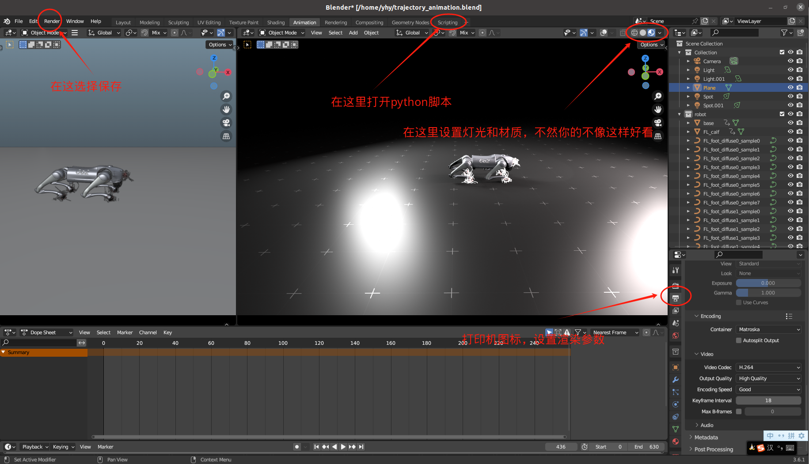

# ICR Blender渲染说明

> [!NOTE] 
> If you have any question , please contact me (yhykid@mail.ustc.edu.cn)

## Tempelate Files

We provide the template files for the motion data of Go2 and H1 in Google Drive.

- [Go2 Template](https://drive.google.com/file/d/1P5khZuAXrZJd7vPlD8zfjrtDuKgXGEQD/view?usp=sharing)
- [H1 Template](https://drive.google.com/file/d/1ZICQdzsb8vNpvwAhrjVBHu3adQ_HAB2z/view?usp=sharing)
- [Go2 with D1 Template](https://drive.google.com/file/d/1lkC47UfXXUenqTx0mdVGtsdorQSdZGhU/view?usp=drive_link)

## Usage

Blender渲染仿真实验，需要收集[time,pos(xyz),quat(wxyz),dof_pos]，收集数据的代码我放在icr文件夹下了

相比于原文，我开发了狗加臂的代码、obj文件、xml文件，完成度应该在90%了，后续可能我会根据我自己的使用情况进行改进

如果需要加入新的obj文件和xml文件，我建议不要跟着model文件夹下的README走，因为很多坑，我们可以在网上找个stl to obj或者dae to obj的网址自己转换

转换后可以自己修改代码里面的rotation  

除复现外，实验室用的代码都在icr文件夹下，欢迎使用

```bash
# For Go2
python convert_state_go2.py
# For H1
python convert_state_h1.py
```
Finally, open Blender, open the `script` tab, run the `import_blender_go2.py` or `import_blender_h1.py` to visualize the motion.


## modified by yhy 

这个仓库是给实验室备用的，这篇原文没什么问题，但是原作者默认我们已经对于blender软件有了一定的基础，但是我们大多数人是没有接触过blender的，所以我就把所有基础部分先列在这里做个参考吧。  

> [!NOTE]
> 我的系统是ubuntu 20.04，blender版本是3.6.1，blender也可以用windows来操作，但是我没用win，就讲linux怎么搞吧。

1. 安装blender-3.6.1
```bash
wget https://download.blender.org/release/Blender3.6/blender-3.6.1-linux-x64.tar.xz
tar -xvf blender-3.6.1-linux-x64.tar.xz
cd blender-3.6.1-linux-x64
./blender
```
但是这样下载后的blender只能双击图标或者这样打开，不能使用命令行blender打开，所以我们需要加个软链接
```bash
# 在刚才blender的文件夹下
sudo ln -s blender /usr/local/bin/blender 
# 这样就可以通过终端输入blender打开了，这样在里面运行文件的时候终端可以实时可视化一些log
```
2. 创建虚拟环境  

在blender-3.6.1中自带的python版本是3.10，但是在blender里面很难配置环境，比如安装一些包，所以我们用虚拟环境来代替
```bash
# 环境名字可以自己取，这里我就用'blenderpy'代替了
conda create -n blenderpy python==3.10
conda activate blenderpy
pip install matplotlib
which python
```
记录一下上面的输出路径,我的是 */home/yhy/anaconda3/envs/blender/bin/python*
```bash
cd ~/Downloads/blender-3.6.1-linux-x64/3.6/python/bin
rm python3.10
sudo ln -s /home/yhy/anaconda3/envs/blender/bin/python python3.10
```
最后在[这行代码](https://github.com/ICRDoge/ICR-blender/blob/main/import_blender_go2.py#L3)中改成自己的路径

3. blender内部操作  

在进入blender之前，先按照前面的教程下载[Go2 Template](https://drive.google.com/file/d/1P5khZuAXrZJd7vPlD8zfjrtDuKgXGEQD/view?usp=sharing)
并且运行
```bash
python convert_state_go2.py
```
打开blender，打开刚才下载的Go2 Template，在上面的一行里面，选择*scripting*，并打开*import_blender_go2.py*
点击运行，这时候blender界面应该是卡住不动的，等渲染结束后就恢复了，然后按空格控制暂停切换
在右下角的打印机图标处，可以设置渲染参数，保存的路径等等
想保存的话，在左上方*Rendering*栏里面有*Render Animation*选项



4. 添加箱子

在blender里面的Animation界面按下*Shift + A*，选择你想添加的东西即可
## TODO

- [x] 复现原文效果
- [x] 加一下在Isaac Gym里面收集保存数据的代码
- [x] 弄一下狗加臂的XML文件
- [x] 弄清楚在blender中加箱子
- [x] blender中的狗加臂的Template文件
- [ ] 装逼